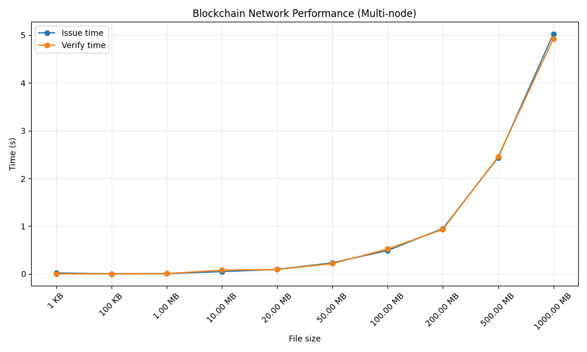

# Blockchain for Aviation Certificate Verification

This project is a prototype system that demonstrates the use of **blockchain technology for secure verification of aviation personnel qualification documents** in a **distributed multi-node environment**.

The system implements a decentralized blockchain where each node maintains its own copy of the chain and participates in **consensus-based verification** of documents.

Only **cryptographic hashes and metadata** are stored on-chain. Original documents are processed **in-memory and remain off-chain**, following industry security standards.

---

## Architecture Overview

The system simulates a **multi-node blockchain network**:

- Each node runs independently (port-based separation)
- Each node has its own local `chain.<port>.json`
- Nodes communicate via REST API
- Verification uses **quorum voting**
- Responses are protected using **digital signatures**

---

## Domain Context (Aviation)

The system simulates verification of critical aviation documents:

- Pilot licenses
- Medical certificates
- Training center diplomas
- Flight permissions and operational qualifications

These documents are essential for **flight safety** and are regulated by:

- ICAO (International Civil Aviation Organization)
- EASA (European Union Aviation Safety Agency)

---

## Purpose of the System

The project demonstrates how blockchain can improve aviation document management by:

- preventing document forgery
- ensuring data integrity and immutability
- enabling multi-party verification (airlines, regulators, training centers)
- providing transparent audit trails of issued certificates
- eliminating single point of trust

---

## How It Works

### 1. Issue certificate
- file is processed in memory
- SHA-256 hash is generated
- hash is signed by issuer
- block is stored locally and broadcast to peers

---

### 2. Verify certificate
- hash is recomputed
- local node verifies against blockchain
- other nodes are queried (`verify_block`)
- responses are signed and validated
- final decision is based on **majority vote (quorum)**

---

### 3. Tampering detection
- any modification of file content
- → hash mismatch
- → system returns `INVALID`

---

## Run (IMPORTANT)

You MUST start the entire distributed system using:

```bash
chmod +x ./scripts/run_nodes.sh
./scripts/run_nodes.sh
```

---

## Performance Metrics

The system includes a performance benchmarking module that evaluates the behavior of the distributed blockchain network under different file sizes and load conditions.

Metrics measure:

* certificate issuance time
* certificate verification time
* network overhead in multi-node mode
* system scalability under increasing data size

The benchmark generates synthetic test files (up to large sizes including hundreds of MB / GB-scale payloads) and evaluates end-to-end processing latency across the running blockchain nodes.

### Run requirements

Before executing metrics, the full blockchain network must be started:

```bash
./scripts/run_nodes.sh
```

All nodes must be fully running and synchronized before starting the benchmark.

Then run:

```bash
python metrics.py
```

---

### Output

After execution, the system generates a visualization of performance results.
Example output:



---

### Notes

* Metrics are computed in a multi-node environment
* Results depend on network communication between nodes
* File sizes are automatically normalized (KB / MB / GB) for readability
* The benchmark is intended for evaluation of system scalability and distributed processing overhead

---